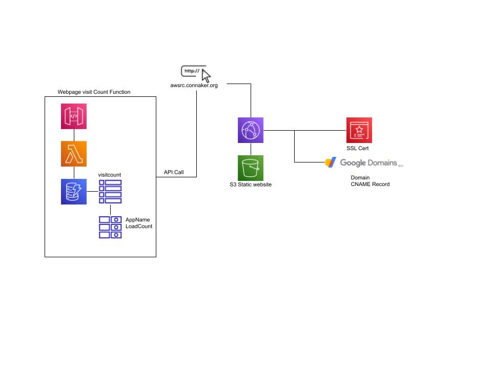

## AWS Cloud Resume Challenge
website: https://cloudresumechallenge.dev/instructions/

So, I am a little late to the party on the Cloud Resume Challenge. The Cloud Resume Challenge started on April 23, 2020 and had certain requirements and conditions that had to be met.

Those conditions were:
- HTML/CSS based website
- Hosted in S3 (Static Website)
- HTTPS
- DNS
- JavaScript
- Database
- API
- Python
- Infrastructure as Code
- Source Control
- CI/CD (Frontend / backend)

## Why take the challenge
I am a veteran of on-premise solutions and on-premise virtualization platforms. I have over ten years of professional experience working with Windows servers 2008,2012,2016 and 2019 and desktops XP through 10. I've worked with network devices (Sonicwall, Cisco, Meraki, etc.), virtualization platforms (Hyper-V, VMware), storage systems (EC2) and more.

Over the last 2 and half years, I have restructured my skills to focus on cloud native. I worked for two years in internal Managed Services at IBM in the IBM Cloud and the last five months as a AWS Site Reliability Engineer. In fact, I've only recent achieved my AWS SysOps Administration certification.

For me, the challenge meant learning more about the components of AWS. While I have worked in AWS fluidly, My core work is in ec2, RDS, iaaC, VPCs, and IAM. This mean there were still things I do not know or have a bit of working knowledge in - coding in JavaScript and Python, configuring API Gateways, configuring CloudFront, Amazon Certificate Manager, and Lambda Functions.

## Completing the Challenge
I completed the challenge by breaking down what was needed. I also skipped over using IaaC in this challenge only because I wanted to learn and understand the Management Console. I will most likely go back over this and build a proper IaaC and redeploy the API in the static website to point to it later on.

Breaking this down, I needed:

PageCount Counter:
- DynamoDB
- Lambda Function
- API Gateway
- Scripts

Website:
- HTML/CSS
- s3
- CloudFront
- Amazon Certificate Manager
- Domain
- DNS

### PageCount Counter

#### DynamoDB
The DynamoDB was a excellent choice for this challenge. It is a key-value and document database, severless and does not require a lot of deep knowledge of querying and database. it is simple in design and easy to create. With DynamoDB, I added two items; the Primary Key with a string value that is looked for in the python script and a second one that is used to update the count.

#### Scripts
I am not a coder by any stretch of the word, so I'd like to thank Don Cameron who also did this challenge and added his script in his documentation. This helped me tremendously.

#### Lambda Function
For the Lambda Function, I created one from scratch using Python 3.7. I then applied Don's code to the Lambda Function.

#### API Gateway
I created a API REST Gateway that was connected to the Lambda Function. The API Gateway was configured with a GET Method and configured with CORS. 

### Website

#### HTML / CSS
For this challenge, I used a template CSS with slight modifications to the css code. I additionally, with A slight modification to Don's code, I was able to add the API gateway URL to the script code he had.

#### s3
I created two s3 buckets - `connaker.org` and `www.connaker.org`. I configured the s3 bucket for `connaker.org` as a static website. `www.connaker.org` was then configured as a redirect to `connaker.org` under the static website. `connaker.org` was updated to be public with a s3 policy to allow public access. Using GitHub Actions, I deployed the website through Github to `connaker.org`

#### Domain, Certificate Manager and CloudFront
I own the domain `connaker.org`. I created a Certificate in Amazon Certificate Manager and added this as a CNAME to the Google Domain's DNS records. After validation, I configured Cloudfront with alternate domain names (CNAMES) `*.connaker.org` and used the custom SSL Certificate I created in ACM. I added the Origin as the S3 buck's website path (NOT the s3 bucket name) and configured the Behaviors for HTTP and HTTPS. I will update the Behaviors for Redirecting HTTP to HTTPS.

Finally, I added the CNAME record for `awsrc.connaker.org` to point to the CloudFront Domain Name.

#### GitHub and GitHub Actions
I deployed a public repo (https://github.com/mconnaker/awsrc) where I configured GitHubActions with a Access Keys and Secret Access Keys of IAM user profile. Any changes made for the frontend (website) on my local machines that are pushed to GitHub are automatically pushed to the s3 bucket.

## What was the Hardest Part
The hardest part for me was setting up CloudFront, ACM to work with Google Domains. Turns out, I had most of CloudFront and ACM right, just understanding how to add the CNAME correctly into Google Domains DNS records was confusing.

## Which Part did I enjoy?
I enjoyed everything about this. It was fun diving and working on these particular services from scratch.

## My Submission
website: https://awsrc.connaker.org  
github: https://github.com/mconnaker/awsrc  
diagram:

